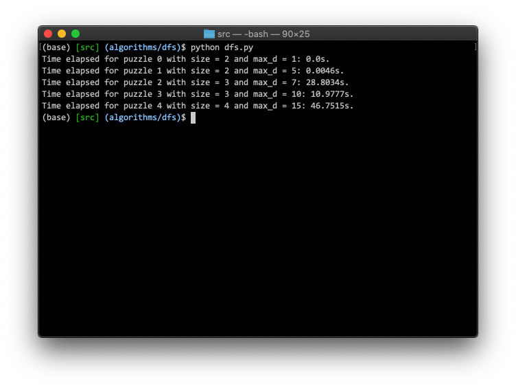

https://github.com/matteo-esposito/comp-472
# COMP 472 | Artificial Intelligence, Winter 2020

## Project 1: Indonesian Dot Puzzle

### Deliverable 1 (Feb 9)

#### Usage (DFS)
1. Clone this repository and enter the `/src` directory.

```bash
git clone https://github.com/matteo-esposito/comp-472.git
cd comp-472/project-1/src/
```

2. Run `dfs.py`

```python
python dfs.py
```

The expected console output should look like:



3. Validate output in `/out` directory.